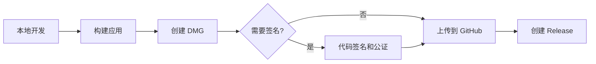

# 📦 发布指南

本文档详细说明了如何打包 Aura 并发布到 GitHub。

---

## 🎯 发布流程概览



---

## 📋 准备工作

### 1. 检查版本号

编辑 `project.yml`:

```yaml
settings:
  base:
    MARKETING_VERSION: "1.0.0"  # ← 更新这里
    CURRENT_PROJECT_VERSION: 1
```

### 2. 更新 Changelog

在项目根目录创建/更新 `CHANGELOG.md`:

```markdown
## [1.0.0] - 2025-10-10

### Added
- 初始版本发布
- 鼠标点击高亮功能
- 多种颜色主题
- 可自定义边框厚度
```

---

## 🛠️ 方法一: 本地手动打包

### 步骤 1: 构建应用

```bash
cd /Users/rokumei_ou/workspace/FocusPointer

# 给脚本执行权限
chmod +x scripts/*.sh

# 构建
./scripts/build.sh
```

**输出**: `build/Export/Aura.app`

### 步骤 2: 创建 DMG

```bash
./scripts/create-dmg.sh
```

**输出**: `build/Aura-1.0.0.dmg`

### 步骤 3: 验证 DMG

```bash
# 挂载 DMG
open build/Aura-1.0.0.dmg

# 测试安装
# 1. 拖动 Aura.app 到一个测试文件夹
# 2. 运行并验证功能
```

### 步骤 4: 上传到 GitHub

#### 方法 A: 使用 GitHub CLI (推荐)

```bash
# 安装 gh (如果未安装)
brew install gh

# 登录
gh auth login

# 创建 Release
gh release create v1.0.0 \
    build/Aura-1.0.0.dmg \
    --title "Aura v1.0.0" \
    --notes "首次发布!

## ✨ 功能
- 🖱️ 鼠标点击高亮
- 🎨 5种颜色主题
- ⚙️ 可自定义设置

## 📥 安装
下载 DMG 文件并拖动到应用程序文件夹即可。"
```

#### 方法 B: 使用 Web 界面

1. 访问 `https://github.com/YOUR_USERNAME/FocusPointer/releases/new`
2. 填写信息:
   - **Tag**: `v1.0.0`
   - **Title**: `Aura v1.0.0`
   - **Description**: 见上方示例
3. 上传 `build/Aura-1.0.0.dmg`
4. 点击 **Publish release**

### 步骤 5: 完整发布脚本

```bash
# 一键完成所有步骤
./scripts/release.sh
```

---

## 🤖 方法二: GitHub Actions 自动化

### 配置自动发布

项目已配置 `.github/workflows/release.yml`,只需:

```bash
# 1. 确保代码已推送
git add .
git commit -m "Ready for v1.0.0 release"
git push

# 2. 创建并推送标签
git tag v1.0.0
git push origin v1.0.0

# 3. GitHub Actions 会自动:
#    - 构建应用
#    - 创建 DMG
#    - 发布 Release
```

### 监控构建状态

访问: `https://github.com/YOUR_USERNAME/FocusPointer/actions`

---

## 🔐 可选: 代码签名和公证

### 为什么需要签名?

- ✅ 用户下载后不会看到安全警告
- ✅ 应用可以通过 Gatekeeper 验证
- ✅ 增加用户信任度

### 要求

- Apple 开发者账户 ($99/年)
- Developer ID 证书
- App 专用密码

### 配置步骤

#### 1. 获取证书

```bash
# 查看已安装的证书
security find-identity -v -p codesigning
```

输出示例:
```
1) ABC123... "Developer ID Application: Your Name (TEAM_ID)"
```

#### 2. 生成 App 专用密码

1. 访问 https://appleid.apple.com
2. 登录 Apple ID
3. 点击 **登录与安全**
4. 点击 **App 专用密码**
5. 生成新密码

#### 3. 编辑签名脚本

编辑 `scripts/sign-and-notarize.sh`:

```bash
# 替换这些值
DEVELOPER_ID_APP="Developer ID Application: Your Name (TEAM_ID)"
APPLE_ID="your-apple-id@example.com"
TEAM_ID="ABC123XYZ"
APP_SPECIFIC_PASSWORD="xxxx-xxxx-xxxx-xxxx"
```

#### 4. 运行签名和公证

```bash
./scripts/sign-and-notarize.sh
```

这将:
1. 签名应用
2. 创建 DMG
3. 签名 DMG
4. 上传至 Apple 公证服务
5. 装订公证票据

**注意**: 公证过程可能需要 5-10 分钟。

---

## 📊 校验和验证

### 生成校验和

```bash
cd build
shasum -a 256 Aura-1.0.0.dmg > checksums.txt
```

### 在 Release 说明中包含

```markdown
## 🔐 SHA256 校验和

`abc123def456... Aura-1.0.0.dmg`

用户可以验证:
\`\`\`bash
shasum -a 256 Aura-1.0.0.dmg
\`\`\`
```

---

## 📝 Release 说明模板

```markdown
## 🎉 Aura v1.0.0

### ✨ 新功能
- 🖱️ 鼠标点击高亮效果
- 🎨 5 种预设颜色主题
- 📏 可调节边框厚度 (小/中/大)
- ⚙️ 菜单栏快速开关
- 💾 自动保存用户设置

### 📥 安装方法

1. 下载 `Aura-1.0.0.dmg`
2. 打开 DMG 文件
3. 拖动 Aura 到应用程序文件夹
4. 首次运行需授予辅助功能权限

### ⚙️ 系统要求

- macOS 13.0 (Ventura) 或更高
- Apple Silicon 或 Intel 处理器

### 🔐 安全性

- [✓] 未签名版本 (可能显示警告)
- 完全开源,可审查代码

### 🐛 已知问题

无

### 📖 文档

- [用户手册](https://github.com/YOUR_USERNAME/FocusPointer/blob/main/README.md)
- [常见问题](https://github.com/YOUR_USERNAME/FocusPointer/wiki/FAQ)

### 🔐 校验和 (SHA256)

\`\`\`
abc123...  Aura-1.0.0.dmg
\`\`\`

---

**下载量**: 0 | **⭐ Star** 支持项目!
```

---

## 🔄 更新发布

### 发布补丁版本

```bash
# 1. 更新版本号
# project.yml: MARKETING_VERSION: "1.0.1"

# 2. 提交更改
git add .
git commit -m "Bump version to 1.0.1"
git push

# 3. 创建标签
git tag v1.0.1
git push origin v1.0.1
```

---

## 📈 发布后清单

- [ ] 测试 DMG 下载和安装
- [ ] 在干净的 macOS 系统上验证
- [ ] 更新 README badges
- [ ] 在社交媒体宣布
- [ ] 更新项目网站 (如果有)
- [ ] 通知用户邮件列表 (如果有)

---

## 🐛 常见问题

### Q: DMG 创建失败

**A**: 确保 `build/Export/Aura.app` 存在:
```bash
./scripts/build.sh
./scripts/create-dmg.sh
```

### Q: GitHub Actions 构建失败

**A**: 检查:
1. `project.yml` 语法是否正确
2. 所有必要的文件是否已提交
3. Actions 日志中的具体错误

### Q: 用户下载后无法打开

**A**: 提示用户:
1. 右键点击应用 → "打开"
2. 或在"系统设置 > 隐私与安全性"中点击"仍要打开"

---

## 📚 相关资源

- [Apple 代码签名指南](https://developer.apple.com/support/code-signing/)
- [公证文档](https://developer.apple.com/documentation/security/notarizing_macos_software_before_distribution)
- [GitHub Releases 文档](https://docs.github.com/en/repositories/releasing-projects-on-github)

---

**🎉 现在你可以轻松发布 Aura 了!**
