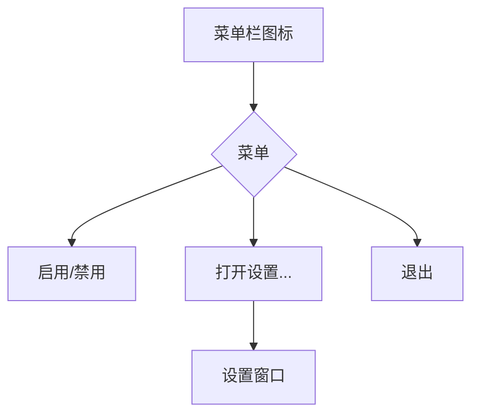
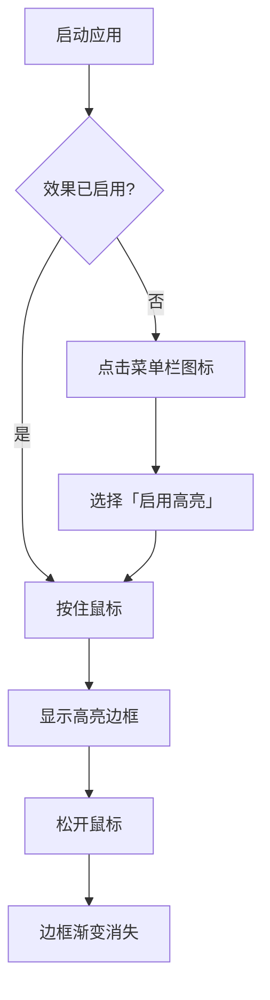

# UI/UX 规格说明：macOS 点击高亮工具

## 1. 引言

本文件旨在为“macOS 点击高亮工具”定义用户体验目标、信息架构、用户流程和视觉设计规范。它将作为视觉设计和前端开发的基础，确保我们创造出内聚且以用户为中心的体验。

### 1.1 整体 UX 目标与原则

**目标用户画像**  
- **专业演示者（主要）**：教师、培训师、产品经理等。他们需要一个专业、不分散注意力的工具来清晰地传达信息。  
- **内容创作者（次要）**：直播主、视频教程制作者。除清晰指示外，也可能偏好更具视觉吸引力的效果。

**可用性目标**  
- **易于上手**：新用户应能在 30 秒内理解并启用核心功能。  
- **无感体验**：工具在后台运行时应做到“隐形”，绝不干扰用户的正常工作流程。  
- **高效配置**：用户应能通过直观的界面快速完成个性化设置。

**设计原则**  
1. **清晰至上**：视觉效果的首要任务是“清晰指示”，而非“炫酷夺目”。  
2. **无缝集成**：应用的设计和交互应使其感觉像是 macOS 原生功能的一部分。  
3. **默认即合理**：应用的默认设置应能满足 80% 用户的需求，无需任何修改即可获得良好体验。  
4. **无障碍优先**：从设计之初就确保所有用户（包括有视觉障碍的用户）都能从中受益。

---

## 2. 信息架构（IA）

### 2.1 屏幕清单与站点地图



### 2.2 导航结构
- **主要导航**：点击系统菜单栏图标后弹出的菜单（访问所有应用功能的唯一路径）。  
- **次要导航**：无（应用不包含第二层级导航）。  
- **面包屑导航**：不适用。

---

## 3. 用户流程

### 3.1 流程：启用并使用高亮效果
**用户目标**：快速启用高亮效果，并在演示时无缝使用以吸引观众注意力。  
**入口点**：应用启动（默认启用）或点击菜单栏图标选择“启用”。  
**成功标准**：按住鼠标时出现高亮边框，松开后边框以动画渐隐，过程不分散用户注意力。



**边界情况与错误处理**  
- **权限问题**：未获得“辅助功能”权限时点击“启用”，应弹出清晰指引，引导用户前往系统设置中授权。

### 3.2 流程：自定义效果外观
**用户目标**：根据个人偏好或演示背景，轻松修改高亮边框的样式。  
**入口点**：点击菜单栏图标中的“设置...”。  
**成功标准**：修改厚度和颜色主题后立即生效，并自动保存。

```mermaid
graph TD
    A[点击菜单栏图标] --> B[选择「设置...」]
    B --> C[打开设置窗口]
    C --> D{修改内容?}
    D -->|厚度| E[选择厚度(小/中/大)]
    D -->|颜色| F[选择颜色主题]
    E --> G[即时应用新厚度]
    F --> G[即时应用新主题]
    G --> H[设置自动保存]
    H --> I[关闭设置窗口]
```

**边界情况与错误处理**  
- **窗口已打开**：再次点击“设置...”应将已打开窗口置于最前，而非新开一个窗口。

---

## 4. 线框与模型（Wireframes & Mockups）

**设置窗口**  
- **标题**：高亮效果设置  
- **区块 1：边框厚度**（分段控件：小 / 中 / 大）  
- **区块 2：颜色主题**（≥ 6 个可点击的渐变预览方块网格）  
- **交互说明**：
  - 任意更改即时生效；无需“保存/应用”按钮。  
  - 设置窗口保持在前，直至用户手动关闭。  
- **设计稿**：高保真视觉设计和原型将于 Figma 中创建（链接待更新）。

---

## 5. 组件库与设计系统

**方法**：不创建独立设计系统；严格遵循 **Apple Human Interface Guidelines (HIG)**；优先使用 **SwiftUI** 原生组件。  

**核心组件**  
1. **分段控件（Option Segmented Control）**：用于互斥选项（边框厚度）。  
   - 状态：Normal / Hover / Pressed / Selected / Disabled。  
2. **颜色主题选择器（Color Theme Selector）**：可视化展示可点击选择的渐变主题。  
   - 状态：Normal / Hover / Pressed / Selected（以更粗描边或勾号标识）。

---

## 6. 品牌与风格指南

- **视觉识别**：以 **Apple HIG** 为准。  
- **色彩**：优先系统语义色，自动适配浅/深色模式。  
- **字体**：**San Francisco (SF)**，采用 SwiftUI 动态文本样式（如 `.headline`、`.body`）。  
- **图标**：**SF Symbols**。  
- **间距与布局**：遵循 HIG 的间距和层次。

---

## 7. 无障碍设计要求（Accessibility）

- **合规目标**：**WCAG 2.1 AA**。  
- **关键要求**：  
  - 视觉：确保色彩对比度达标，为键盘焦点提供清晰指示。  
  - 交互：设置窗口支持纯键盘操作与 **VoiceOver** 屏幕阅读器。  
- **测试策略**：使用 **Xcode Accessibility Inspector** + 手动 **VoiceOver** 测试。

---

## 8. 窗口与响应式策略

- 设置窗口采用优化的固定尺寸，并设定合理的最小尺寸，禁止缩小到更小。  
- MVP 阶段禁用最大化，以保持界面简洁聚焦。

---

## 9. 动画与微交互

- **动效原则**：快速、简洁、有意义；采用自然缓动（如“缓入缓出”）。  
- **关键动画**：  
  1. **边框渐显与渐隐（Border Fade-in & Fade-out）**：按住出现、松开消失；时长约 **0.2–0.3 s**。  
  2. **设置窗口出现/消失**：遵循 macOS 标准窗口动画（系统默认时长）。

---

## 10. 性能考量

- **启动**：< 1 s  
- **内存**：后台闲置 < 50 MB  
- **CPU**：闲置接近 0%  
- **动画帧率**：≥ 60 FPS  
- **支持策略**：最小化界面与原生控件；按需加载设置窗口；利用系统图形加速实现轻量动画。

---

## 11. 后续步骤

**立即行动**  
- 确认并最终化本《UI/UX 规格说明》。  
- 在 Figma 中创建高保真视觉设计与交互原型。  
- 将文档与设计稿移交给架构师，产出详细的实现方案。

**设计移交清单**  
- [x] 用户流程已文档化  
- [x] 组件清单已完成  
- [x] 无障碍设计要求已定义  
- [x] 窗口/响应式策略已明确  
- [x] 品牌指南已融入  
- [x] 性能目标已建立
